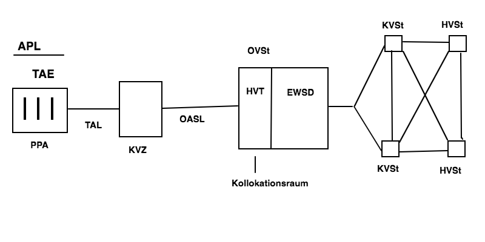

# Telekommunikation

## Aufbau des klassischen Telefonnetzes

Das klassische analoge Telefonetz wird auch __POTS__ genannt, was von "plain old telephone service" abzuleiten ist.

### TAE = Telekommunikations-Anschluss-Einheit

Anschlussdose für analoge Telefonanschlüsse (a/b - Schnittstelle) und ISDN-Anschlüsse zum Anschlißene des NTBA an die Anschlussleitung.

### PPA = Passiver Prüfabschluss

Dient zu Messzwecken im Telefonnetz. Sie makiert den Abschlusspunkt der Verantwortlichkeit des Netzbetreibers. 

### APL = Abschlusspunkt des Liniennetzes

Ist das Ende ders Verzweigungskables der Teilnehmeranschlussleitung im Telefonnetz.

### TAL = Teilnehmeranschlussleitung (letzte Meile)

Stellt die Verbindung zwischen der Ortsvermittlungsstelle des Netzbetreibers und dem Telefonanschluss des Dienstnutzers dar.
Besteht aus einer Kupfer-Doppelader.

### KVZ = Kabelverzweiger

Der Kabelverzweiger ist ein passiver Schaltschrank zur Kabelverteilung der Leitungen innerhalb eines Fernsprech-Ortsnetzes,der Hauptkabel mit Verzweigungskabel verbindet.

### OASL = Ortsanschlussleitung

Stellt die Verbindung zwischen dem Kabelverzweiger und der Ortsvermittlungsstelle dar.

### OVSt = Ortsvermittlungsstelle

Ortsvermittlungsstellen bieten je nach Ausbauzustand zwischen 100 und 10.000 Teilnehmernummern. Sie sind die Verbindung von Teilnehmerendgeräten an KVSt oder HVSt. Letze Ziffer der Ortskennzahl

#### HVT = Hauptverteiler

Stehen im __Kollokationsraum__ einer jeden OVSt und verlegen Hauptkabel zu den KVZ.

#### EWSD = Elektronisches Wählsystem Digital

Produktbezeichnung der digitalen Vermittlungsstelle von Siemens, die auch in der OVSt untergebracht war.

#### S12

Digitale Vermittlungsanlage von Alcatel, die früher in der OVSt benutzt wurde.

### KVSt = Knotenvermittlungsstelle

### HVSt = Hauptvermittlungsstelle

## Aufbau einer Telefonnummer

Eine Telefonnummer ist maximal 15 Ziffern lang. 

         VAZ          ONKZ       Teilnehmer
        00|49       5 4 2 1      12345678   

### VAZ = Verkehrsausscheidungsziffer

Unterscheidet zwischen Innland- uns Auslandanrufen.

### ONKz = Ortsnetzkennzahl

Wird aus der HVSt (1. Ziffer), der KVSt (2. & 3. Ziffer ) und der OVSt (letzte Ziffer) gebildet. In dicht besiedelten Bereichen ist die OVSt 2-stellig.

